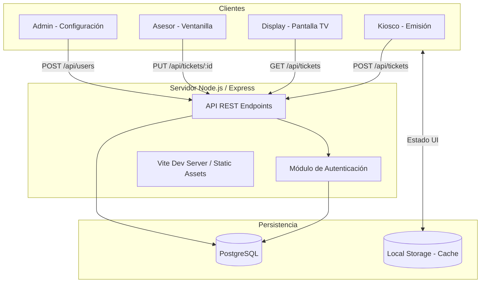
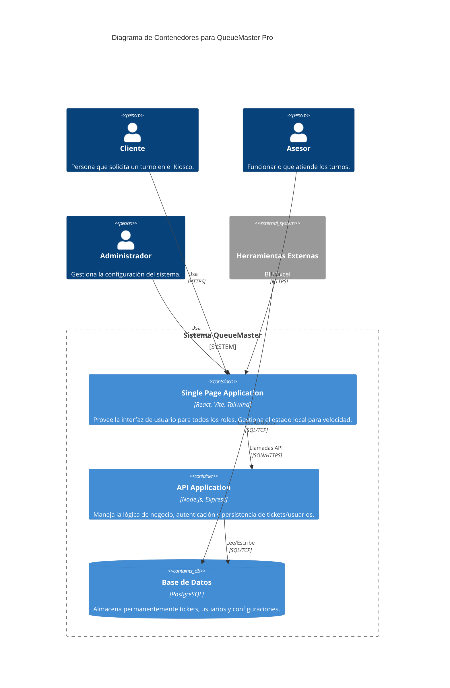

# Diagramas de Arquitectura - QueueMaster Pro

## 1. Diagrama de Arquitectura de Alto Nivel (Flujo de Datos)

## 2. Diagrama de Contenedores (C4 Model - Nivel 2)

## 3. Segregación de Contenedores por Rol

| Contenedor | Rol Acceso | Responsabilidad Principal |
| :--- | :--- | :--- |
| **Kiosk Container** | `kiosk` | Captura de ID y selección de categoría. |
| **Display Container** | `display` | Notificación visual y auditiva de turnos. |
| **Advisor Container** | `advisor` | Gestión del ciclo de vida del turno (Llamar -> Atender -> Cerrar). |
| **Admin Container** | `admin` | CRUD de usuarios y parámetros del sistema. |
